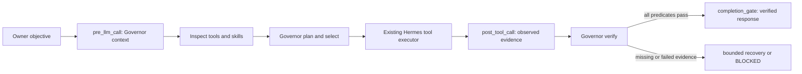

# Architecture

Governor is a native user plugin plus a small generic host extension. It does not replace Hermes executors, task storage, skills, approvals, memory, scheduling, or tool search.

The host patch adds `completion_gate` as an opt-in lifecycle hook and makes plugin-requested completion policy available at the turn boundary. The hook fails closed only when a plugin requested required verification but no gate supplies a decision. It also buffers user-visible assistant text for guarded turns and uses Hermes' existing bounded `pre_verify` continuation path for non-coding objectives.

Governor registers `pre_llm_call`, `pre_tool_call`, `post_tool_call`, `pre_verify`, and `completion_gate`. It asks Hermes' existing skill discovery to provide metadata, accepts model-proposed candidates, ranks them with deterministic penalties, and records only redacted decision metadata. Actual tool results remain in Hermes' normal transcript storage.

Hermes can defer plugin schemas behind `tool_search`. The host helper inventories only the session-scoped deferred tools for policy decisions. The model calls Governor through the existing `tool_describe` / `tool_call` bridge; Hermes unwraps it before policy, approval, executor, and observation hooks run.

The SOUL append is intentionally generic. The installer appends it without replacing the target PC's existing identity or personal/business context.
